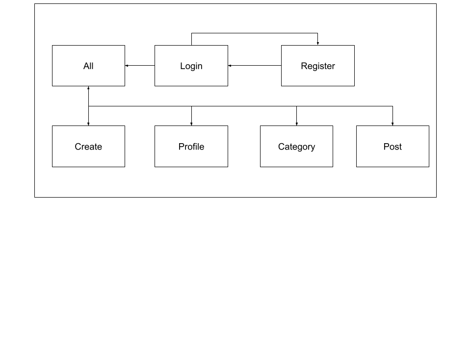

# Hobbist

## Overview

There are many forms of blogs and communications online from Facebook to Instragram to Reddit. However, it is difficult to share an indepth view of any passion an user has. Hobbyist is a web app that acts as a blog for users with a focus on any hobbies they want to share in their many different mediums. User can register and login. Once they are logged in, they can create a blog post with optional field description. The user can view all other users' blogs, all of their own posts, or search for specific content. Users can also like and comment on posts in order for the community to thrive with the ability to delete their own posts.

## Data Model

The application will store Users, Posts, and Comments.

* users can have multiple posts (via references)
* each post can have multiple comments (via references)
* each comment can have only one post and one user who owns the comment (via references)

A User with references to Posts and other Users:

```javascript
{
	name: String,
	hash: {type: String, required: true},
 	posts: [{type: mongoose.Schema.Types.ObjectId, ref: 'Post'}]
}
```

A Post with references to Comments items and User:

```javascript
{
	user: {type: mongoose.Schema.Types.ObjectId, ref: 'User'},
	content: String,
	title: String,
	category: String,
  	comments: [{type: mongoose.Schema.Types.ObjectId, ref: 'Comment'}],
  	createdAt: Date,
  	likes: [{type: mongoose.Schema.Types.ObjectId, ref: 'User'}]
}
```

A Comment with reference to User who owns the Comment and the Post the Comment is under:

```javascript
{
	user: {type: mongoose.Schema.Types.ObjectId, ref: 'User'},
	content: String,
	post: {type: mongoose.Schema.Types.ObjectId, ref: 'Post'}
}
```


## [Link to Commented First Draft Schema](db.mjs) 

[First Draft Schema](/server/src/db.mjs)

## Wireframes


/login - page to login to an exist account

/register - page to create an account

/feed - page which 50 of the most recent posts or posts by users the user follows

/post - page to display a specific post with comments along with like and comment form functionality

/create - page with a form to create a post with an optional image insert field

/profile - page displaying all posts made by the user

## Site map



## User Stories or Use Cases

1. As non-registered user, I can register a new account with the site.
2. As a user, I can log in to the site.
3. As a user, I want to share my hobbies through posts.
4. As a user, I want to see other user's hobbies and activities.
5. As a user, I want to like and comment on other user's posts.
6. As a user, I want to see all of my posts.
7. As a user, I want to delete my posts.
8. As a user, I want to search for a specific category of posts.

## Research Topics

* (2 points) Bootstrap
    * use Bootstrap CSS framework to create a theme
* (6 points) React
    * use React as the front-end framework
* (3 points) dotenv
    * use dotenv as a configuration management to connect to MongoDB Atlas
    * store MongoDB username, password, and url
    * configure API endpoints for React from local host to my AWS hosting url api endpoint

11 points total out of 10 required points


## [Link to Initial Main Project File](/) 

[Initial Main Project](/)

Because there is a frontend ReactJS server and a backend ExpressJS server, there are two servers running at the same time. I run both servers at the same time in order for communciations to happen using concurrently and the command ```npm run dev``` in the root directory of the project.

## Annotations / References Used

(__TODO__: list any tutorials/references/etc. that you've based your code off of)

1. [Concurrently package](https://www.npmjs.com/package/concurrently) - used to run both ExpressJS and ReactJS servers at the same time with the React client commuicating with the Express backend server.
2. [ReactJS frontend with ExpressJS backend](https://www.freecodecamp.org/news/how-to-create-a-react-app-with-a-node-backend-the-complete-guide/) - what I used to research how to setup my ReactJS frontend and have it communicate with the ExpressJS backend through API endpoints.
3. [ReactJS Navbar Reference](https://react-bootstrap.github.io/utilities/transitions/) - used to start my React NavBar and routing implementation.
4. [ReactJS NavBar Reference](https://retool.com/blog/building-a-react-navbar/) - used this as well to learn about React NavBars
5. [Bootstrap Documentation](https://getbootstrap.com/docs/4.0/getting-started/introduction/) - reference this to style my applications through buttons, cards, navbar, and more.
6. [dotenv in React](https://create-react-app.dev/docs/adding-custom-environment-variables/) - learned about using dotenv in React
