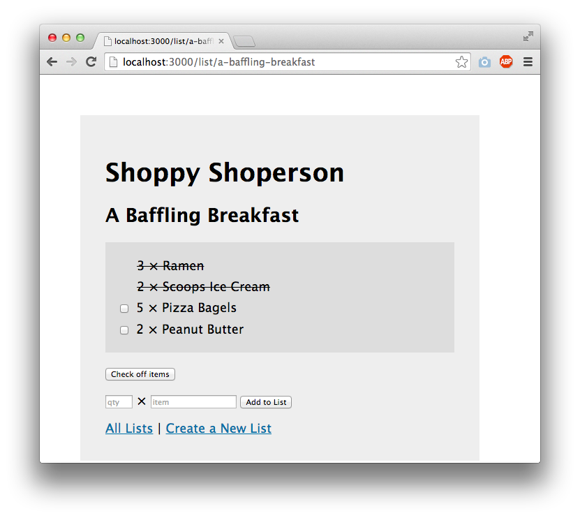

# Hobbist

## Overview

There are many forms of blogs and communications online from Facebook to Instragram to Reddit. However, it is difficult to share an indepth view of any passion an user has. Hobbist is a web app that acts as a blog for users with a focus on any hobbies they want to share in their many different mediums. User can register and login. Once they are logged in, they can create a blog post with optional fields such as descriptions, images, and guides. The user can view all other users' blogs, have a personalized feed through a follow function, or search for specific content. Users can also like and comment on posts in order for the community to thrive.

## Data Model

The application will store Users, Posts, and Comments.

* users can have multiple posts (via references)
* users can have multiple 
* each post can have multiple comments (by embedding or referenmces, don't know which one is better yet)

An User with references to Posts and other Users:

```javascript
{
  username: "I Eat Tea"
  hash: // a password hash
  posts: // an array of references to Post documents
  follows: // an array of references to User documents
  followers: // an array of references to User documents
}
```

A Post with embedded Comments items:

```javascript
{
  user: // a reference to a User object
  title: "Origami Godzilla"
  category: // a category String entered by user or a dropdown menu
  comments: [
    { user: Toad, content: "very cool"}
    { user: Frog, content: "very not cool"}
  ]
  createdAt: // timestamp
  likes: 0
}
```


## [Link to Commented First Draft Schema](db.mjs) 

(__TODO__: create a first draft of your Schemas in db.mjs and link to it)

## Wireframes


/list/create - page for creating a new shopping list


/list - page for showing all shopping lists


/list/slug - page for showing specific shopping list



## Site map

(__TODO__: draw out a site map that shows how pages are related to each other)

Here's a [complex example from wikipedia](https://upload.wikimedia.org/wikipedia/commons/2/20/Sitemap_google.jpg), but you can create one without the screenshots, drop shadows, etc. ... just names of pages and where they flow to.

## User Stories or Use Cases

(__TODO__: write out how your application will be used through [user stories](http://en.wikipedia.org/wiki/User_story#Format) and / or [use cases](https://en.wikipedia.org/wiki/Use_case))

1. as non-registered user, I can register a new account with the site
2. as a user, I can log in to the site
3. as a user, I can create a new grocery list
4. as a user, I can view all of the grocery lists I've created in a single list
5. as a user, I can add items to an existing grocery list
6. as a user, I can cross off items in an existing grocery list

## Research Topics

(__TODO__: the research topics that you're planning on working on along with their point values... and the total points of research topics listed)

* (5 points) Integrate user authentication
    * I'm going to be using passport for user authentication
    * And account has been made for testing; I'll email you the password
    * see <code>cs.nyu.edu/~jversoza/ait-final/register</code> for register page
    * see <code>cs.nyu.edu/~jversoza/ait-final/login</code> for login page
* (4 points) Perform client side form validation using a JavaScript library
    * see <code>cs.nyu.edu/~jversoza/ait-final/my-form</code>
    * if you put in a number that's greater than 5, an error message will appear in the dom
* (5 points) vue.js
    * used vue.js as the frontend framework; it's a challenging library to learn, so I've assigned it 5 points

10 points total out of 8 required points (___TODO__: addtional points will __not__ count for extra credit)


## [Link to Initial Main Project File](app.mjs) 

(__TODO__: create a skeleton Express application with a package.json, app.mjs, views folder, etc. ... and link to your initial app.mjs)

## Annotations / References Used

(__TODO__: list any tutorials/references/etc. that you've based your code off of)

1. [passport.js authentication docs](http://passportjs.org/docs) - (add link to source code that was based on this)
2. [tutorial on vue.js](https://vuejs.org/v2/guide/) - (add link to source code that was based on this)

