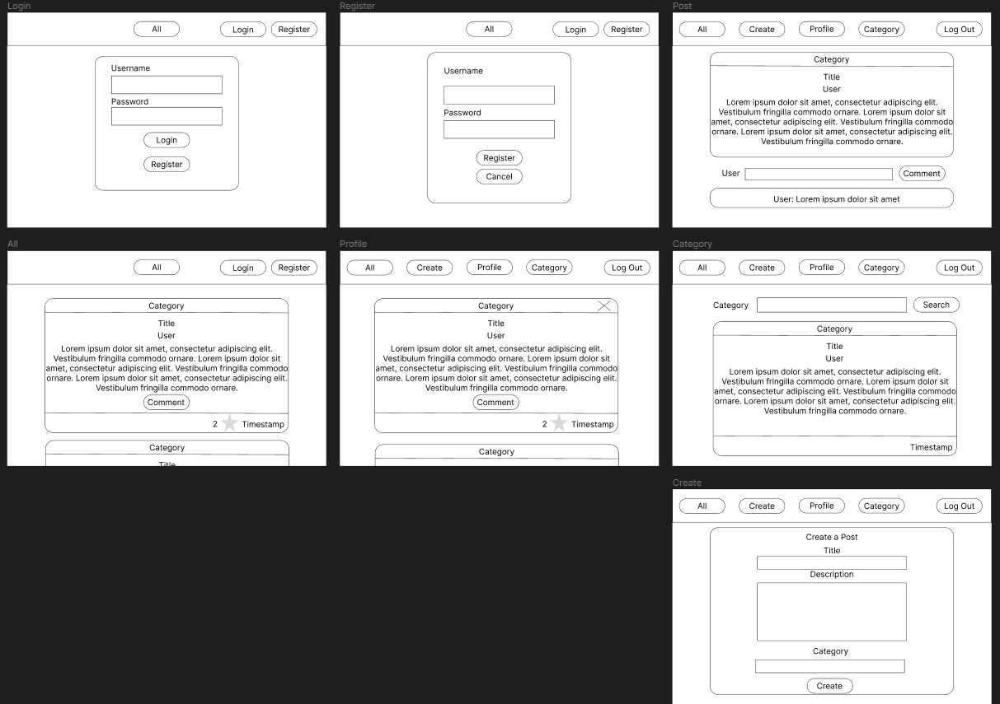

# Hobbist

## Overview

There are many forms of blogs and communications online from Facebook to Instragram to Reddit. However, it is difficult to share an indepth view of any passion an user has. Hobbist is a web app that acts as a blog for users with a focus on any hobbies they want to share in their many different mediums. User can register and login. Once they are logged in, they can create a blog post with optional fields such as descriptions, images, and guides. The user can view all other users' blogs, have a personalized feed through a follow function or a simple view all, or search for specific content. Users can also like and comment on posts in order for the community to thrive.

## Data Model

The application will store Users, Posts, and Comments.

* users can have multiple posts (via references)
* each post can have multiple comments (by embedding or referenmces, don't know which one is better yet)

A User with references to Posts and other Users:

```javascript
{
  username: "I Eat Tea"
  hash: // a password hash
  posts: // an array of references to Post documents
  follows: // an array of references to User documents
  followers: // an array of references to User documents
}
```

A Post with embedded Comments items:

```javascript
{
  user: // a reference to a User object
  title: "Origami Godzilla"
  category: // a category String entered by user or a dropdown menu
  comments: [
    { user: Toad, content: "very cool"}
    { user: Frog, content: "very not cool"}
  ]
  createdAt: // timestamp
  likes: // an array of references to User documents
}
```


## [Link to Commented First Draft Schema](db.mjs) 

[First Draft Schema](db.mjs)

## Wireframes



/login - page to login to an exist account

/register - page to create an account

/feed - page which 50 of the most recent posts or posts by users the user follows

/post - page to display a specific post with comments along with like and comment form functionality

/create - page with a form to create a post with an optional image insert field

/profile - page displaying all posts made by the user

## Site map

[Site Map](documentation/sitemap.png)

## User Stories or Use Cases

1. As non-registered user, I can register a new account with the site.
2. As a user, I can log in to the site.
3. As a user, I want to share my hobbies through posts.
4. As a user, I want to see other user's hobbies and activities.
5. As a user, I want to like and comment on other user's posts.
6. As a user, I want to see all of my posts.

## Research Topics

(__TODO__: the research topics that you're planning on working on along with their point values... and the total points of research topics listed)

* (5 points) Integrate user authentication
    * I'm going to be using passport for user authentication
    * And account has been made for testing; I'll email you the password
    * see <code>cs.nyu.edu/~jversoza/ait-final/register</code> for register page
    * see <code>cs.nyu.edu/~jversoza/ait-final/login</code> for login page
* (4 points) Perform client side form validation using a JavaScript library
    * see <code>cs.nyu.edu/~jversoza/ait-final/my-form</code>
    * if you put in a number that's greater than 5, an error message will appear in the dom
* (5 points) vue.js
    * used vue.js as the frontend framework; it's a challenging library to learn, so I've assigned it 5 points

10 points total out of 8 required points (___TODO__: addtional points will __not__ count for extra credit)


## [Link to Initial Main Project File](app.mjs) 

[Initial Main Project](app.mjs)

## Annotations / References Used

(__TODO__: list any tutorials/references/etc. that you've based your code off of)

1. [passport.js authentication docs](http://passportjs.org/docs) - will most likely use this for login feature

